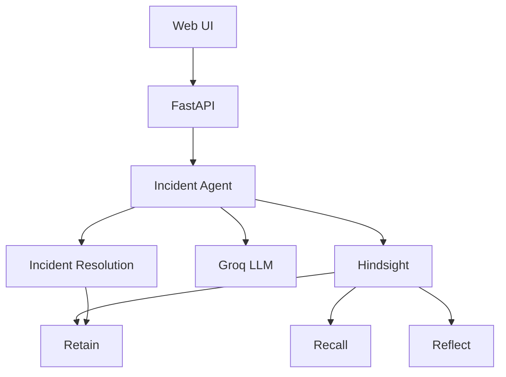

# Incident Response Agent

An AI incident-response assistant that remembers what happened before — including root causes, attempted fixes, and outcomes — and uses that experience when a similar incident happens again.

The agent combines **Hindsight long-term memory** with an LLM to turn incident response from a fresh investigation into a memory-backed workflow.

## The Problem

When a production incident happens, engineers often have to reconstruct the same knowledge repeatedly:

* Have we seen this failure before?
* What caused it?
* What did we try?
* Which fix actually worked?
* Did a previous workaround fail?

A standard LLM can reason about the incident in front of it, but without persistent memory it starts each investigation with the same lack of historical context.

This project gives the agent a memory of previous incidents and, importantly, stores the **outcome of new resolutions** back into that memory.

---

## The Idea

The core workflow is:

```text
                    ┌─────────────────────┐
                    │   Historical        │
                    │   Incidents         │
                    └──────────┬──────────┘
                               │
                            RETAIN
                               │
                               ▼
                    ┌─────────────────────┐
                    │      Hindsight      │
                    │    Agent Memory     │
                    └──────────┬──────────┘
                               │
                            RECALL
                               │
                               ▼
┌────────────────┐    ┌─────────────────────┐
│ New Incident   │───▶│  Incident Agent     │
└────────────────┘    │                     │
                      │  Historical context │
                      │        +            │
                      │      LLM            │
                      └──────────┬──────────┘
                                 │
                                 ▼
                         Suggested response
                                 │
                                 ▼
                           Human resolves
                                 │
                                 ▼
                              RETAIN
                                 │
                                 └──────────────▶ Hindsight
```

The important part is the feedback loop:

**retain → recall → resolve → retain again**

A resolved incident becomes another piece of experience that can be recalled later.

---

## Why Hindsight?

Hindsight provides the memory layer for the agent.

This project uses three core operations:

| Operation   | Purpose in this project                                |
| ----------- | ------------------------------------------------------ |
| **Retain**  | Store historical incidents and new resolution outcomes |
| **Recall**  | Find relevant past incidents for a new incident        |
| **Reflect** | Synthesize higher-level patterns across incidents      |

The normal incident path uses `recall` because the agent needs relevant historical evidence during an active incident. The `reflect` endpoint is used when the goal is to reason across multiple memories and identify recurring patterns.

This separation follows Hindsight's intended model: recall retrieves relevant memories, while reflect is used for synthesis across memory.

---

## How the Agent Works

### 1. Seed historical incidents

The repository includes five curated incident records covering different services and failure modes.

Each incident contains information such as:

* service
* error signature
* symptoms
* root cause
* resolution steps
* resolution time
* timestamp

`ingest.py` converts these records into Hindsight memories using `retain`.

```python
client.retain(
    bank_id=BANK_ID,
    content=content,
    context="past incident postmortem",
    timestamp=inc.get("timestamp"),
    metadata={
        "service": inc["service"],
        "incident_id": inc["id"]
    },
)
```

---

### 2. Recall relevant experience

When a new incident is submitted, the agent sends its description to Hindsight:

```python
recalled = await memory.arecall(
    bank_id=BANK_ID,
    query=description
)
```

The most relevant returned memories are passed to the LLM as historical context.

The model is instructed to use that context to provide a concise, actionable response for an engineer handling a live incident.

---

### 3. Handle incidents with or without memory

The agent has two paths.

#### When relevant memory exists

The model receives historical incidents and is instructed to identify close matches and explain what worked or failed previously.

```text
New incident
      ↓
Hindsight recall
      ↓
Relevant historical incidents
      ↓
LLM analysis
      ↓
Specific recommended action
```

#### When no relevant memory exists

The agent explicitly tells the model that no matching incident was found and asks for a best-effort troubleshooting response.

```text
New incident
      ↓
Hindsight recall
      ↓
No relevant memory
      ↓
General debugging response
```

This distinction makes it possible to see whether the agent is using historical experience or starting from a new incident pattern.

---

## The Memory Loop

The most important part of the project happens after the incident is resolved.

When the engineer records a resolution, the application stores:

* the original incident
* the attempted resolution
* whether the resolution worked

```python
content = (
    f"Incident: {description}\n"
    f"Resolution attempted: {resolution}\n"
    f"Outcome: "
    f"{'This resolved the issue.' if worked else 'This did NOT resolve the issue.'}"
)

await memory.aretain(
    bank_id=BANK_ID,
    content=content,
    context="incident resolution outcome",
)
```

That means the memory layer does not contain only historical incident descriptions.

It can also contain the outcome of what engineers actually tried.

### Example

```text
Incident:
Postgres connection pool exhausted

Attempt:
Restarted the affected service

Outcome:
Did NOT resolve the issue
```

Later:

```text
Incident:
Postgres connection pool exhausted

Attempt:
Fixed the connection leak

Outcome:
Resolved the issue
```

A future incident can recall this history and give the engineer more useful context than a generic troubleshooting answer.

---

## Recall vs Reflect

The project also exposes a reflection endpoint.

### Recall

Use recall for:

> "Have we seen something like this before?"

The agent retrieves relevant memories and passes them to the LLM.

### Reflect

Use reflect for:

> "What recurring problems have we seen in this service?"

The project exposes:

```text
POST /api/reflect
```

with:

```json
{
  "service": "payments-api"
}
```

Hindsight can then synthesize a higher-level view across the incident memories for that service.

This makes the memory layer useful at two levels:

```text
Recall  → specific incident experience
Reflect → broader operational patterns
```

---

## Demo Scenario

The repository includes a concrete `payments-api` incident involving PostgreSQL connection exhaustion.

One sample incident contains:

```text
Service:
payments-api

Error:
psycopg2.OperationalError:
FATAL: remaining connection slots are reserved

Root cause:
A background reconciliation job opened database
connections without closing them, exhausting the
Postgres connection pool.

Resolution:
Identify the stuck job
→ kill the job
→ restart the service
→ fix connection handling
```

### Recommended demo flow

#### Step 1 — Submit an incident

Submit a new incident similar to the historical PostgreSQL failure.

The UI shows whether related memories were found.

#### Step 2 — Inspect the recalled memories

Show that the agent has historical context for the incident rather than responding from an empty context.

#### Step 3 — Resolve the incident

Enter a resolution note and mark the incident as:

```text
✅ Resolved
```

or:

```text
❌ Didn't work
```

The outcome is retained in Hindsight.

#### Step 4 — Submit a similar incident again

This is the key demonstration.

The next response can now use the newly stored resolution outcome in addition to the earlier incident history.

The goal is to demonstrate:

```text
First encounter
      ↓
Historical context
      ↓
Resolution
      ↓
Resolution stored
      ↓
Second encounter
      ↓
Historical context + previous outcome
```

This demonstrates that the system is not only performing a static lookup — the incident lifecycle itself adds new experience to memory.

---

## Architecture



### Components

**Web UI**

A lightweight browser interface for submitting incidents, viewing recalled memories, and recording resolution outcomes.

**FastAPI**

Provides the application API and serves the frontend.

**Incident Agent**

Coordinates Hindsight memory retrieval, LLM prompting, incident responses, resolution retention, and reflection.

**Hindsight**

Provides persistent agent memory through retain, recall, and reflect.

**Groq**

Provides the LLM used to generate the incident-response analysis.

---

## API

### `POST /api/incident`

Analyze a new incident.

Request:

```json
{
  "description": "payments-api is throwing database connection errors and checkout requests are timing out"
}
```

Response includes:

```json
{
  "response": "...",
  "matched_memories": [],
  "had_memory_match": true
}
```

---

### `POST /api/resolve`

Store an incident resolution outcome.

Request:

```json
{
  "description": "payments-api is throwing database connection errors",
  "resolution": "Fixed the connection leak in the reconciliation job",
  "worked": true
}
```

---

### `POST /api/reflect`

Ask Hindsight for a higher-level view of a service's incident history.

Request:

```json
{
  "service": "payments-api"
}
```

Response:

```json
{
  "insight": "..."
}
```

---

## Project Structure

```text
Incident-Response-Agent/
│
├── agent.py
│   └── Core memory + LLM logic
│
├── app.py
│   └── FastAPI application and API endpoints
│
├── ingest.py
│   └── Loads historical incidents into Hindsight
│
├── generate_data.py
│   └── Generates additional synthetic incident data
│
├── data/
│   └── sample_incidents.json
│       └── Curated incident dataset
│
├── static/
│   └── index.html
│       └── Browser interface
│
├── requirements.txt
│   └── Python dependencies
│
├── .env.example
│   └── Environment-variable template
│
└── .gitignore
```

---

## Tech Stack

| Layer         | Technology                   |
| ------------- | ---------------------------- |
| Language      | Python                       |
| API           | FastAPI                      |
| Agent memory  | Hindsight                    |
| LLM           | Groq / OpenAI-compatible API |
| Validation    | Pydantic                     |
| Configuration | python-dotenv                |
| Frontend      | HTML / CSS / JavaScript      |

---

## Getting Started

### 1. Clone the repository

```bash
git clone https://github.com/varunchow/Incident-Response-Agent.git
cd Incident-Response-Agent
```

### 2. Create a virtual environment

macOS / Linux:

```bash
python3 -m venv venv
source venv/bin/activate
```

Windows:

```powershell
python -m venv venv
venv\Scripts\activate
```

### 3. Install dependencies

```bash
pip install -r requirements.txt
```

### 4. Configure environment variables

Copy:

```bash
cp .env.example .env
```

Then configure:

```text
GROQ_API_KEY=...
GROQ_MODEL=openai/gpt-oss-120b

HINDSIGHT_API_KEY=...
HINDSIGHT_BASE_URL=https://api.hindsight.vectorize.io
HINDSIGHT_BANK_ID=incident-response-demo
```

Never commit the real `.env` file or API keys.

### 5. Load incident memories

The repository includes curated sample incidents, so you can ingest them immediately:

```bash
python ingest.py
```

### 6. Generate additional synthetic incidents

To create a larger dataset:

```bash
python generate_data.py
```

The generator creates additional incidents in batches and writes them to:

```text
data/incidents.json
```

Run ingestion again after generating the data:

```bash
python ingest.py
```

### 7. Start the application

```bash
uvicorn app:app --reload --port 8000
```

Open:

```text
http://localhost:8000
```

---

## Data Model

A historical incident follows this general structure:

```json
{
  "id": "INC-001",
  "service": "payments-api",
  "error_signature": "...",
  "symptoms": "...",
  "root_cause": "...",
  "resolution_steps": "...",
  "resolution_time_minutes": 22,
  "timestamp": "2026-04-12T09:15:00Z"
}
```

This structure gives Hindsight enough context to retrieve incidents based on symptoms and technical details rather than relying only on an incident ID.

---

## What Makes the Project Different

The project is built around one simple idea:

> **Incident response should improve from experience.**

The agent does not only retrieve an old incident.

It can remember:

```text
What happened
      ↓
Why it happened
      ↓
What engineers tried
      ↓
Whether it worked
      ↓
What happened next
```

That creates a persistent operational memory that can be reused during future investigations.

---

## Limitations

This project is intentionally focused on the **memory and reasoning layer** of incident response.

It currently does not:

* automatically execute production remediation commands
* connect directly to Kubernetes, PagerDuty, Slack, or observability platforms
* guarantee that a recalled incident is the correct match
* replace human judgment during a production incident

The current system uses synthetic and curated incident data rather than a live production incident stream.

For a real deployment, retrieved memories would need stronger evaluation, access control, observability, and integration with the organization's operational systems.

---

## Future Improvements

Potential next steps include:

* Connect the agent to real monitoring and alerting systems
* Integrate with Slack or incident-management platforms
* Add an incident history dashboard
* Display retrieval relevance information
* Expand the incident dataset across more failure categories
* Add automated evaluation of memory retrieval quality
* Add human approval workflows for production actions
* Support separate Hindsight memory banks for different teams or environments

---

## Hindsight Resources

* Hindsight GitHub
* Hindsight Documentation
* Vectorize: What Is Agent Memory?

Hindsight provides the persistent memory layer used by this project, including retain, recall, and reflect workflows.

---

## License

Add your preferred open-source license here.

---

## Summary

```text
Traditional agent:

Incident → LLM → Response


This project:

Incident
   ↓
Hindsight Recall
   ↓
Historical Context
   ↓
LLM Analysis
   ↓
Resolution
   ↓
Hindsight Retain
   ↓
Future Incident
   ↓
Better Historical Context
```

The interesting part is not simply asking an LLM how to fix an incident.

The interesting part is giving the agent a memory of what engineers already learned — and feeding the outcomes of new incidents back into that memory.
